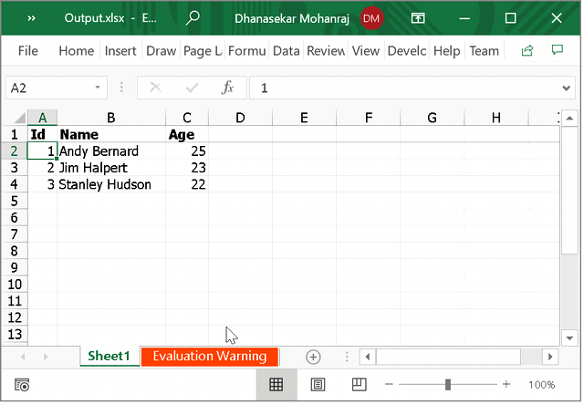

# How to Freeze Header Row in Exported Excel File in WPF DataGrid?

This sample show cases how to freeze header row in exported excel file in [WPF DataGrid](https://www.syncfusion.com/wpf-controls/datagrid) (SfDataGrid).

You can freeze the header row in the exported Excel sheet using FreezePanes method in `IRange` interface in `DataGrid`.

#### C#
```c#
//Select freeze pane range
//To freeze a row or column, the selected range should be next to the row or column.
IRange range = worksheet[2, 1];
//Create freeze pane in first row
range.FreezePanes();
```
**Note: Once you run the sample exported excel file saved inside the bin folder.**



Take a moment to peruse the [WPF DataGrid - Excel Exporting](https://help.syncfusion.com/wpf/datagrid/export-to-excel) documentation, where you can find about DataGrid excel exporting with code examples.

## Requirements to run the demo
 Visual Studio 2015 and above versions